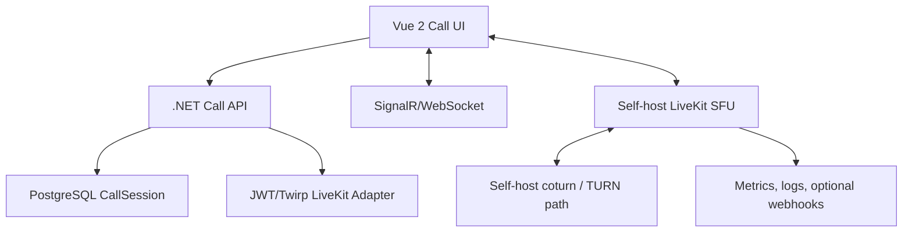

# Working Specification - Internal 1:1 Video Call Module

- Project: SimlyDent
- Task: TASK-002
- Version: 2026-08-05
- Status: Research specification; chưa phải implementation contract

## 1. Objective

Xây module video call 1:1 giữa hai nhân viên đã đăng nhập trên web bằng giải pháp open-source, có thể self-host media/signaling core, cho phép SimlyDent tùy biến UI và business lifecycle, đồng thời tránh runtime dependency bắt buộc vào dịch vụ video SaaS.

## 2. Definitions

- **Caller/callee:** user khởi tạo/nhận cuộc gọi.
- **Call session:** authoritative business record do backend SimlyDent sở hữu.
- **Media session/room:** resource của WebRTC platform; không thay thế call session.
- **Eligible session:** tab/device đang authenticated, authorized và có thể nhận invitation.
- **Self-host:** signaling/media core chạy trên hạ tầng do doanh nghiệp kiểm soát.
- **Forced TURN:** test ép relay hoặc thu bằng chứng selected candidate type là `relay`.

## 3. Core requirements

### R-01 - Direct call

Caller chọn callee theo user trong hệ thống và khởi tạo cuộc gọi, không yêu cầu trao đổi meeting URL thủ công.

### R-02 - Lifecycle

Hỗ trợ incoming, ringing, accept, reject, cancel, busy, no-answer, connecting, in-call, reconnecting, hangup và ended.

### R-03 - Media

Audio/video hai chiều, mute/unmute, camera on/off và device selection cơ bản trên browser mục tiêu.

### R-04 - Network

Hỗ trợ NAT traversal, self-host STUN/TURN và có test evidence cho relay path.

### R-05 - Security

- Chỉ user đã đăng nhập được tạo/nhận call.
- Backend kiểm tra cùng tenant và quyền gọi trước khi tạo session hoặc cấp media credential.
- Token ngắn hạn, scope tối thiểu theo room/identity/publish/subscribe.
- Secret không xuất hiện ở frontend/log/repository.
- Transition atomic và idempotent.

### R-06 - Browser targets

- MUST: Chrome/Edge desktop phiên bản được team khóa trước PoC.
- SHOULD: Chrome Android và Safari iOS bằng thiết bị thật.
- Background/closed-browser incoming push là extension riêng.

### R-07 - Ownership

SimlyDent sở hữu UI, call state, call log, audit, user/tenant mapping và decision lúc nào user được join media.

## 4. Non-core extensions

- Recording.
- Screen share.
- Group call.
- Push notification.
- App-level E2EE.
- PSTN/SIP gateway.

Các extension không được dùng để loại candidate ở core phase, nhưng kiến trúc không nên khóa đường mở rộng khi stakeholder xác nhận cần thiết.

## 5. Canonical state model

```text
Created -> Ringing -> Accepted -> Connecting -> InCall -> Ended
              |          |            |
              |          |            +-> Reconnecting -> InCall/Ended
              |          +-> Ended
              +-> Rejected/Cancelled/Busy/NoAnswer/Unavailable -> Ended
```

Chi tiết transition/race: `internship-log/work/TASK-002-web-video-call/docs/call-transition-rules.md`.

## 6. Authority boundaries

| Concern | Authority |
|---|---|
| User/tenant authorization | SimlyDent backend |
| Call invitation/state | SimlyDent backend + PostgreSQL |
| Presence delivery | SimlyDent realtime channel |
| Media credential issuance | SimlyDent backend adapter |
| Media transport | Self-hosted SFU/gateway/WebRTC + TURN |
| Browser media UI | Vue 2 module |
| Audit/call log | SimlyDent backend |

Media/server events được dùng để reconcile và quan sát. Chúng không được tự ý đảo ngược terminal business state.

## 7. Candidate policy

### Included for spike

- LiveKit self-host - preferred.
- mediasoup - differential comparator.
- Raw WebRTC + coturn - architecture baseline.

### Conditional

- Janus - chỉ sau GPL-3.0 legal review.

### Excluded from current comparative PoC

- Managed-only communication APIs, gồm Stringee.
- Meeting-centric/full communication apps khi không có lợi thế module rõ: Jitsi, Element Call, MiroTalk, Nextcloud Talk.
- Additional distribution layer chưa tạo lợi thế rõ: OpenVidu Community.
- Low-level library không phải module solution: Pion.

## 8. Proposed LiveKit spike architecture



Token chỉ được phát sau atomic accept. Room name phải unguessable hoặc không có giá trị authorization nếu không kèm scoped token. Mọi token issuance phải truy vết tới call session và user/tenant đã authorize.

## 9. Core acceptance scenarios

1. A1 gọi A2 và kết thúc bình thường.
2. A2 reject.
3. A1 cancel đồng thời A2 accept; chỉ một transition thắng.
4. A2 busy với cuộc gọi khác.
5. No-answer timeout.
6. A1 gọi B1 khác tenant và bị từ chối trước media credential.
7. A2 nhiều tab; chỉ một tab accept thắng.
8. Network interruption/reconnect.
9. Forced TURN/relay.
10. Desktop caller đến mobile-web callee.

## 10. Required evidence

- Version/commit/image tags.
- Sanitized deployment configuration.
- Browser/OS/device/network metadata.
- Backend transition log.
- Media server/webhook event log khi có.
- Raw WebRTC stats, gồm candidate pair.
- CPU/RAM/network snapshot.
- Reproduction steps và Pass/Fail/Inconclusive.

Screenshot hoặc video demo không thay thế raw evidence.

## 11. Operations/TCO inputs

- Calls/day, concurrent calls, average duration.
- Direct vs relay ratio.
- Average send/receive bitrate.
- Outbound bandwidth price.
- Compute/Redis/TURN/monitoring/storage.
- Recording ratio và retention nếu được mở scope.
- Upgrade, backup, security patch và on-call effort.

Không được kết luận “free” hoặc “rẻ nhất” chỉ từ license.

## 12. Decision rule

Candidate chỉ được đề xuất production khi:

- Vượt toàn bộ hard gates.
- Không có tenant/security failure.
- Core scenarios có test evidence trên browser/network mục tiêu.
- Có runbook, metrics và failure/restart behavior.
- License được legal chấp nhận.
- TCO/effort nằm trong ngưỡng stakeholder chấp nhận.

Desk research hiện đề xuất **LiveKit self-host làm spike đầu tiên**. Đây chưa phải final architecture decision.

## 13. Canonical references

- [Research report](internship-log/work/TASK-002-web-video-call/docs/bao-cao-nghien-cuu-video-call.md)
- [Evidence table](internship-log/work/TASK-002-web-video-call/references/evidence-table.md)
- [Source log](internship-log/work/TASK-002-web-video-call/references/source-log.md)
- [Candidate spike plan](internship-log/work/TASK-002-web-video-call/docs/candidate-spike-plan.md)
- [PoC matrix](internship-log/work/TASK-002-web-video-call/docs/poc-test-matrix.md)
